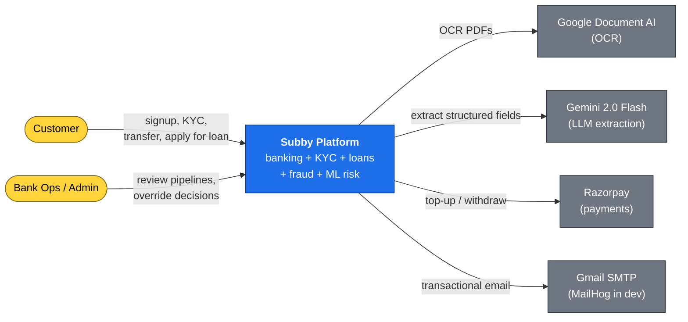
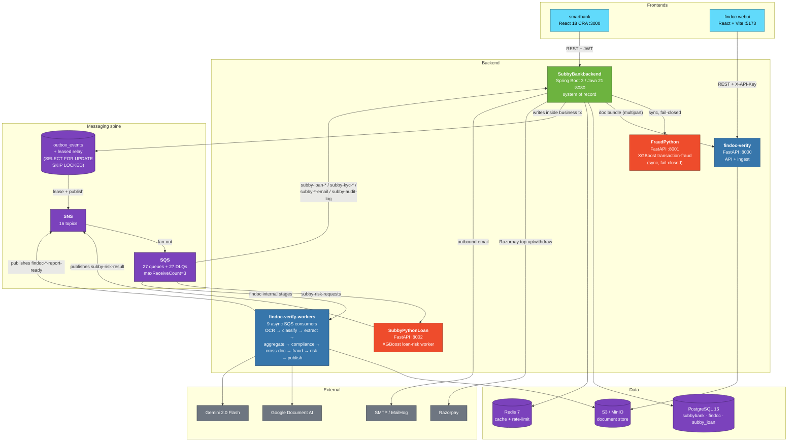
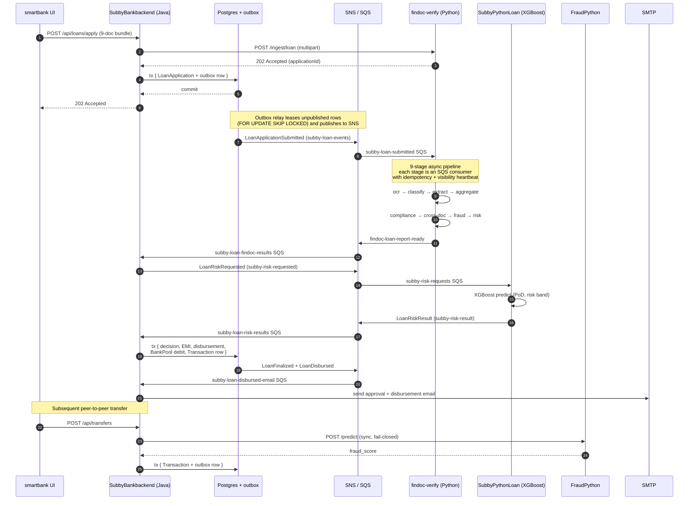
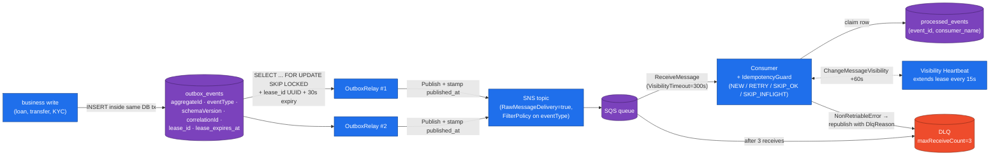
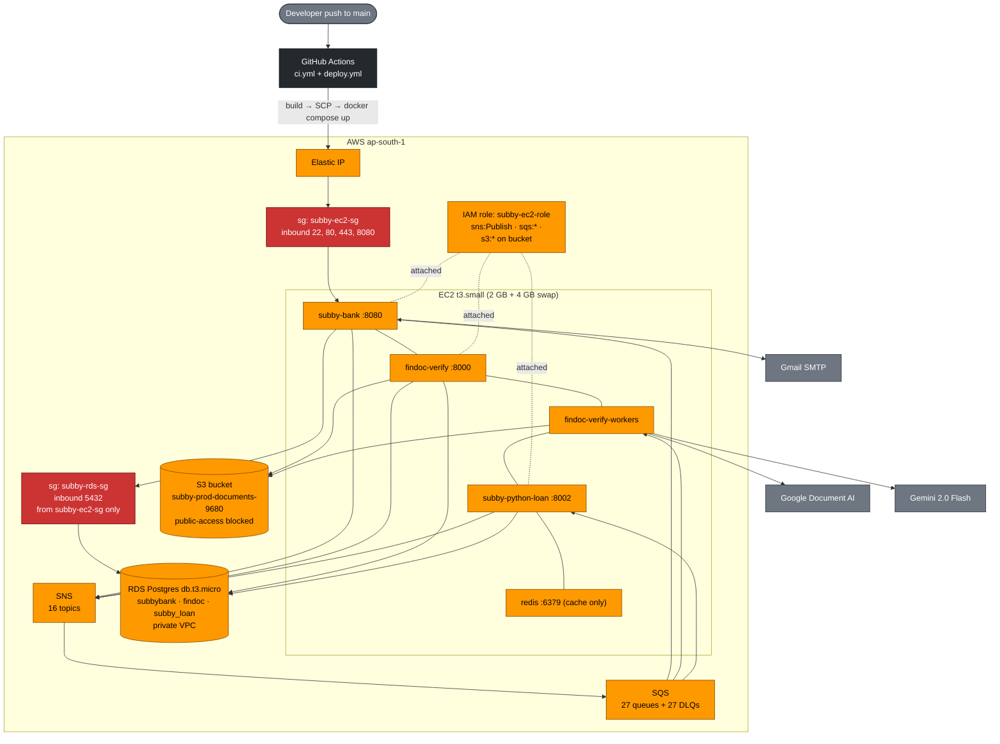

# Subby — Production-Grade Digital Banking Platform

**Java 21 · Spring Boot 3 · Python 3.12 · FastAPI · React 18 · PostgreSQL · Redis · AWS (SNS / SQS / S3 / EC2 / RDS / IAM) · Docker · XGBoost · Microservices · Event-Driven · CI/CD · Distributed Systems · Backend Engineer · Full-Stack · ML Engineering · Fintech**

> An event-driven polyglot microservices banking platform — account opening, KYC, payments, internal transfers, loan origination, ML risk scoring, and live transaction-fraud detection. The whole thing is wired through a transactional outbox plus SNS/SQS plus DLQs plus an idempotency layer, so it keeps working when a replica dies mid-publish, when SQS redelivers the same message, or when an operator replays a queue.
>
> It runs on AWS today — EC2, RDS, SNS, SQS, S3, with GitHub Actions doing the deploys. The same code runs on a laptop with one `docker compose up`. Moving between the two is a profile flip; not a single line of business code changes.

<p align="left">
  
  
  
  
  
  
  
  
  
  
  
  
  
</p>

---

## Architecture — system context (C4 Level 1)



---

## Architecture — runtime container view (C4 Level 2)

This reflects the **actual** services, queues, and dependencies as wired in [docker-compose.yml](docker-compose.yml), [infra/localstack-init.sh](infra/localstack-init.sh), and [findoc-verify/scripts/localstack-init.sh](findoc-verify/scripts/localstack-init.sh).



**Counts are real**, not aspirational:
- **16 SNS topics** = 7 cross-service ([`infra/localstack-init.sh:46-57`](infra/localstack-init.sh#L46-L57)) + 9 findoc-internal stages ([`findoc-verify/scripts/localstack-init.sh:11-23`](findoc-verify/scripts/localstack-init.sh#L11-L23)).
- **27 primary SQS queues + 27 DLQs** = 18 cross-service bindings + 9 findoc-internal worker queues. Every primary queue has a paired DLQ with `maxReceiveCount=3` ([`infra/localstack-init.sh:128-135`](infra/localstack-init.sh#L128-L135)).
- **14 Java SQS consumer classes** in [`SubbyBankbackend/src/main/java/backend/backend/messaging/consumer/`](SubbyBankbackend/src/main/java/backend/backend/messaging/consumer/).
- **9 findoc workers** in [`findoc-verify/src/workers/`](findoc-verify/src/workers/).

---

## Architecture — loan origination event flow

This is one full origination from "user clicks Apply" to "funds in account". Every arrow is a real handler in this codebase.



---

## Architecture — the messaging spine (the part that matters)



**Why this design** — the engineering deep-dive lives in [`ARCHITECTURE.md`](ARCHITECTURE.md).

---

## Architecture — AWS deployment topology (as shipped)



**FraudPython is intentionally omitted on AWS** — t3.small can't fit it alongside SubbyPythonLoan; Spring Boot's `FraudClient` enters DEGRADED mode (low-value transfers allowed, high-value rejected). Full topology + cost notes in [`DEPLOYMENT.md`](DEPLOYMENT.md).

---

## The four backend services + two frontends

| Service | Stack | Responsibility |
| :--- | :--- | :--- |
| **`SubbyBankbackend`** | Spring Boot 3 / Java 21 / Postgres / Redis | System of record. Users, KYC state, bank accounts, transfers, loan lifecycle, admin overrides, JWT auth, Razorpay, transactional outbox + relay. |
| **`findoc-verify`** | FastAPI / Python 3.12 / async SQLAlchemy | KYC + loan-origination document pipeline. 9 async stages over SQS: OCR → classify → extract → aggregate → compliance → cross-doc → fraud → risk → publish. |
| **`SubbyPythonLoan`** | FastAPI / Python 3.12 / XGBoost | Async loan-risk worker. Consumes `LoanRiskRequested`, runs the model, emits `LoanRiskResult` with PoD + risk band. |
| **`FraudPython`** | FastAPI / Python 3.12 / XGBoost | Synchronous per-transaction fraud scorer. Called fail-closed on the transfer hot-path. |
| **`smartbank`** | React 18 (CRA) + Tailwind | Customer + admin web UI. Signup, KYC upload, dashboard, transfers, loan apply, statement, admin override. |
| **`findoc-verify/webui`** | React + Vite | Pipeline operator UI — per-stage timeline, OCR previews, compliance / cross-doc / fraud detail, final LoanReport. |

---

## Engineering features that matter

These are the pieces I'd want a reviewer to actually open. Every claim below points at the real file.

### 1. Transactional outbox with leased multi-replica relay

Every domain event is written to `outbox_events` **inside the same DB transaction** as the originating business write. A relay polls under `SELECT ... FOR UPDATE SKIP LOCKED`, publishes to SNS, and stamps `published_at`. Each row is leased with a `lease_id` UUID + 30s expiry, so two relay replicas run safely and a crash mid-publish releases its rows automatically. A unique constraint on `(aggregate_id, event_type, schema_version)` closes any application-layer race.
→ [`OutboxRelay.java`](SubbyBankbackend/src/main/java/backend/backend/messaging/OutboxRelay.java), [`OutboxEvent.java`](SubbyBankbackend/src/main/java/backend/backend/messaging/OutboxEvent.java)

### 2. Four-state idempotency claim

Every consumer claims an `(event_id, consumer_name)` pair through `processed_events`:

- `NEW` — first sighting, run the handler.
- `RETRY` — prior `FAILED` row under `MAX_RETRIES`, run again.
- `SKIP_OK` — already `SUCCEEDED` or exhausted, ack and drop.
- `SKIP_INFLIGHT` — `PENDING`, another replica is mid-handle, leave for redelivery.

At-least-once SQS delivery is filtered into **exactly-once business effects** with replay safety on transient failures.
→ [`IdempotencyGuard.java`](SubbyBankbackend/src/main/java/backend/backend/messaging/IdempotencyGuard.java)

### 3. SQS visibility heartbeat

While a handler runs, an `asyncio` task (Python) or in-tx scheduled callback (Java) calls `ChangeMessageVisibility` every 15s to extend the lease. Long-running document pipelines (Document AI + Gemini) no longer get redelivered mid-execution.

### 4. DLQ + replay

Per-queue DLQs catch poison messages after `maxReceiveCount=3`. The findoc consumer additionally republishes `NonRetriableError` failures **directly** to its DLQ with a `DlqReason` MessageAttribute so they don't burn the redelivery budget.

### 5. Schema versioning on the wire

Every event extends `DomainEvent` (Java) or builds an envelope (Python) carrying `schemaVersion`. The version travels in **both** the JSON envelope and as an SNS `MessageAttribute`, so consumers can branch without parsing the body. Java's `DomainEvent.eventType()` is resolved from a `@EventType` annotation — never inferred from the class name (which would silently break under refactors).

### 6. Correlation-id pipeline

A single `correlationId` flows through:

```
HTTP request header → CorrelationIdFilter / Middleware
  → SLF4J MDC / Python ContextVar
  → outbox row → SNS MessageAttribute + JSON envelope
  → SQS consumer extracts it back to MDC
  → outbound WebClient / boto3 publisher re-injects it
```

To trace a request end-to-end: `grep -h "<corrId>" subby-bank.log findoc-verify.log subby-python-loan.log`

### 7. Admin loan override with reversal

`POST /api/admin/loans/{loanAppId}/override` flips a finalized loan's decision. On `APPROVED → REJECTED` for a previously disbursed loan, `reverseDisbursement()` debits the user's account, returns funds to the bank pool, writes a reversal `Transaction` row, and clears `hasLoan` / `loanamount`. The audit row is keyed by `(loanApplicationId, overriddenBy, newDecision)` — replay returns the prior row with `idempotent: true`. `REQUIRES_NEW` keeps the inner finalize step atomic with side-effects; the `wasApproved` retry guard prevents double-reversal.

### 8. ML feature bridge — pragmatic engineering

The loan-risk event contract carries a rich feature set (`monthly_income`, `dti_ratio`, `fraud_score`, `employment_type`, ...) but the production model was trained on 5 columns. Rather than ship a model that doesn't match the contract, [`SubbyPythonLoan/README.md`](SubbyPythonLoan/README.md) documents the runtime feature bridge and the `prob_eligible` → `probability_of_default` inversion — and is honest about retraining as future work.

### 9. Production-shaped local infra

`docker compose up -d --build` brings up a stack **structurally identical** to production:

- LocalStack 4.0.3 (SNS + SQS + S3) with init scripts that match AWS line-for-line.
- MinIO as alternative S3 backend, swappable via `S3_ENDPOINT_URL`.
- Postgres 16 with three databases and per-DB roles.
- Redis 7 for Spring cache + Bucket4j rate-limit token buckets.
- MailHog SMTP sink with web UI.
- Document AI via mounted ADC (no service-account JSON — complies with org policies blocking long-lived keys).

To go to real AWS: unset `AWS_ENDPOINT_URL`, set `SPRING_PROFILES_ACTIVE=aws`, attach IAM instance role. **No code changes.**

---

## Tech stack (for keyword scanners)

| Layer | Tech |
| :--- | :--- |
| **Languages** | Java 21, Python 3.12, TypeScript / JavaScript ES2022, SQL |
| **Backend frameworks** | Spring Boot 3.5, Spring Security, Spring Data JPA, Hibernate, FastAPI, async SQLAlchemy, Pydantic |
| **Frontend** | React 18, CRA, Vite, Tailwind CSS, Axios |
| **Persistence** | PostgreSQL 16, Redis 7, Caffeine in-process cache |
| **Migrations** | Flyway (Java), Alembic (Python) |
| **Messaging** | AWS SNS + SQS, RawMessageDelivery, FilterPolicy, FIFO-ready, DLQs (`maxReceiveCount=3`), LocalStack 4.0 in dev |
| **Object storage** | AWS S3, MinIO |
| **ML / AI** | XGBoost (loan + fraud), scikit-learn, Pandas, NumPy, Google Document AI (OCR), Gemini 2.0 Flash (extraction) |
| **Auth** | JWT access + refresh tokens, Bcrypt, `X-API-Key` (SHA-256 hashed) for service-to-service |
| **Resilience** | Bucket4j rate limiting, transactional outbox, leased relay, idempotency keys, DLQs, visibility heartbeat, correlation IDs |
| **Security** | PII encryption at rest (Aadhaar / PAN), SHA-256 hashed API keys, KMS-encrypted S3 in prod, S3 public-access block, IAM instance role |
| **Payments** | Razorpay SDK (top-up, withdraw, signature verification) |
| **Observability** | Spring Boot Actuator + Micrometer + Prometheus, custom `outbox.*` and `sqs.*` metrics, JSON structured logs with `correlationId`, MailHog |
| **Cloud** | AWS EC2, RDS, SNS, SQS, S3, IAM, Elastic IP, Security Groups, ap-south-1 |
| **Build / CI/CD** | Maven, pip + pyproject.toml, npm, Docker multi-stage, GitHub Actions (`ci.yml`, `deploy.yml`) |
| **Infra-as-code (dev)** | docker-compose.yml + LocalStack init scripts + postgres-init.sql |
| **Testing** | JUnit 5, Mockito, pytest, integration smoke tests, e2e probes |

---

## Quickstart

```bash
cp .env.example .env          # GEMINI_API_KEY + Doc AI processor IDs
docker compose up -d --build  # ~90s for healthchecks
```

| Service | Port | Purpose |
| :--- | :--- | :--- |
| `subby-bank` | `8080` | Spring Boot API |
| `findoc-verify` | `8000` | FastAPI + 9 SQS workers |
| `subby-python-loan` | `8002` | XGBoost loan-risk worker |
| `fraud-python` | `8001` | XGBoost transaction-fraud scorer |
| `postgres` | `5433` | shared cluster |
| `redis` | `6379` | Spring cache |
| `localstack` | `4566` | SNS / SQS / S3 emulator |
| `minio` | `9000`, `9001` | alt S3 + console |
| `mailhog` | `1025`, `8025` | SMTP sink + UI |

```bash
cd smartbank          && npm install && npm start      # CRA :3000
cd findoc-verify/webui && npm install && npm run dev   # Vite :5173

curl -s http://localhost:8080/actuator/health/readiness
curl -s http://localhost:8080/actuator/prometheus | grep -E 'outbox|sqs'
```

---

## Live demo path (93 seconds, blank slate → disbursed loan)

1. **Sign up** at `http://localhost:3000`.
2. **Submit KYC** with `infra/fixtures/aadhaar.pdf` + `pan.pdf`. `SUBMITTED → DOCS_UNDER_REVIEW → KYC_APPROVED` in ~15s.
3. **Apply for a loan** with the 9-document bundle (3 statements, 3 payslips, employment letter, ITR, credit report).
4. **Pipeline runs**: OCR → classify → extract → aggregate → compliance → cross-doc → fraud → risk. `DOCS_VERIFIED` in ~80s.
5. **ML risk scoring** publishes `LoanRiskResult` with band + decision.
6. **Loan APPROVED**, EMI computed, funds disbursed from `bank_pool` → user account.
7. (Optional) **Admin override** at `/admin` reverses the decision; `reverseDisbursement` debits the user, returns to pool, writes a reversal Transaction.

```bash
./infra/e2e-smoke-test.sh
./infra/smoke-loan-disbursed.sh
./infra/smoke-reverse-reject-then-override.sh
./infra/smoke-replay-approve-to-ml.sh
```

Walkthrough: [`infra/DEMO.md`](infra/DEMO.md). Architecture deep-dive: [`ARCHITECTURE.md`](ARCHITECTURE.md). AWS deployment: [`DEPLOYMENT.md`](DEPLOYMENT.md). Full local setup (prereqs, env files, troubleshooting): [`LOCAL_SETUP.md`](LOCAL_SETUP.md).

---

## Repository layout

```
.
├── ARCHITECTURE.md            ← engineering deep-dive (read this)
├── DEPLOYMENT.md              ← real AWS deployment, CI/CD, costs
├── docker-compose.yml         ← whole stack, one command
├── docker-compose.aws.yml     ← AWS profile compose
│
├── SubbyBankbackend/          ← Spring Boot 3 / Java 21 — system of record
│   └── src/main/java/backend/backend/
│       ├── controller/        REST API
│       ├── service/           loans, transfers, KYC, override
│       ├── messaging/         outbox, relay, SNS publisher, 14 SQS consumers
│       ├── model/             JPA entities incl. outbox_events
│       ├── security/          JWT, filter chain, RBAC
│       ├── chatbot/           Gemini-powered helper
│       └── configuration/     properties classes, AWS SDK setup
│
├── findoc-verify/             ← FastAPI + 9 async SQS workers
│   ├── src/                   API, workers, models, OCR, LLM, pipeline stages
│   ├── alembic/               schema migrations
│   ├── webui/                 Vite + Tailwind operator UI
│   └── scripts/               api-key minter, localstack-init
│
├── SubbyPythonLoan/           ← XGBoost loan-risk worker
├── FraudPython/               ← XGBoost transaction-fraud scorer
├── smartbank/                 ← React 18 customer + admin UI
└── infra/                     ← LocalStack init, AWS bootstrap, smoke tests
    ├── localstack-init.sh     ← shared topics, queues, DLQs, subscriptions
    ├── aws-bootstrap.sh       ← provisions real AWS topology
    ├── postgres-init.sql      ← creates DBs + roles
    └── *.sh                   ← e2e + smoke tests
```

---

## Known limitations & deliberate tradeoffs

The repo is honest about what it doesn't do:

- **Single-replica rate limiting.** Bucket4j is in-process; horizontal scale needs a Redis-backed shared limiter.
- **No spend cap on Gemini / Document AI.** A bulk submission could burn the budget before manual intervention.
- **Model versioning** is a `modelVersion` field; rollback is "redeploy the prior container."
- **Saga for the override-finalize window.** [`ARCHITECTURE.md` § 5](ARCHITECTURE.md) describes one transactional window where an audit row can be lost (no money is moved twice; `wasApproved` guard prevents double-reversal).
- **OCR vendor lock to Document AI.** No Textract / Tesseract fallback.
- **LLM lock to Gemini 2.0 Flash.** No LiteLLM / OpenAI / Anthropic.
- **FraudPython not on AWS** — t3.small RAM budget; Spring Boot's `FraudClient` runs in DEGRADED mode without it.
- **Frontends not yet on AWS** — backend reachable via Elastic IP; S3 + CloudFront pending.

These are intentional scope boundaries documented at the time of writing, not unknowns.

---

## Author

**Rajdeep Mandal** — backend, distributed systems, applied ML.

- Email: **rajdeep.mandal@reverside.co**
- This repo is a portfolio piece. For a 5-minute walkthrough → [`infra/DEMO.md`](infra/DEMO.md). For the engineering reasoning → [`ARCHITECTURE.md`](ARCHITECTURE.md). For the real AWS deploy → [`DEPLOYMENT.md`](DEPLOYMENT.md).

> If you're hiring for backend, full-stack, distributed systems, or platform roles — I'd love to talk.
