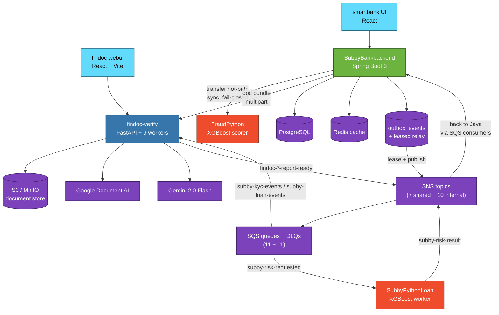

# Subby — Production-Grade Digital Banking Platform

> **Event-driven, polyglot microservices** simulating a real consumer-finance stack:
> account opening, KYC, payments, internal transfers, loan origination, ML risk
> scoring, and live transaction-fraud detection — all wired through a
> **transactional outbox + SNS/SQS + DLQ + idempotency** spine that survives
> partial failure, replicas, and replays.

<p align="left">
  
  
  
  
  
  
  
  
  
  
  
  
  
</p>

---

## TL;DR for the impatient reviewer

This monorepo is a **four-service banking platform** built to look and behave
like something you would actually trust money to. It runs end-to-end on a
laptop in a single `docker compose up` and migrates to real AWS by flipping a
profile — **zero code changes**.

**The interesting bits aren't the features, they're the plumbing:**

- A **transactional outbox** with a leased multi-replica relay — concurrent
  publishers can run safely without duplicate emissions.
- A **four-state idempotency claim** (`NEW / RETRY / SKIP_OK / SKIP_INFLIGHT`)
  that converts at-least-once SQS delivery into exactly-once business effects.
- An **SQS visibility heartbeat** that extends the lease every 15s so long ML
  pipelines don't get redelivered mid-execution.
- A **per-queue DLQ** with redrive after `maxReceiveCount=3`, plus explicit
  poison-pill republish carrying a `DlqReason` attribute.
- A **schema-versioned event envelope** carried in both JSON and SNS message
  attributes, so consumers can branch without parsing the body.
- A **correlation-id pipeline** that threads through HTTP → MDC → outbox →
  SNS → SQS → MDC → downstream HTTP, end-to-end traceable.
- An **admin loan-override path** that reverses a disbursed loan, debits the
  bank pool, writes an idempotent audit row, and uses `REQUIRES_NEW` to keep
  the inner finalize step atomic with side-effects.

End-to-end demo path verified at **93 seconds** from blank slate to an
APPROVED, disbursed loan — see [`infra/DEMO.md`](infra/DEMO.md).

> **Architecture deep-dive:** the hard engineering tradeoffs and reliability
> reasoning live in [`ARCHITECTURE.md`](ARCHITECTURE.md). Read that next.

---

## Table of contents

1. [Why this codebase exists](#why-this-codebase-exists)
2. [The four services](#the-four-services)
3. [End-to-end flow](#end-to-end-flow)
4. [Engineering features that matter](#engineering-features-that-matter)
5. [Tech stack](#tech-stack)
6. [Quickstart](#quickstart)
7. [Live demo path](#live-demo-path)
8. [Repository layout](#repository-layout)
9. [Operational tooling](#operational-tooling)
10. [Production swap (LocalStack → real AWS)](#production-swap)
11. [Known limitations & deliberate tradeoffs](#known-limitations--deliberate-tradeoffs)
12. [Author](#author)

---

## Why this codebase exists

Most "fintech demo" projects on a resume are CRUD apps with a JWT login screen.
This one was built around the parts that actually break in real banking
systems: **partial failures, duplicate deliveries, replicas racing the same
event, multi-step pipelines that can't restart from scratch, and audit trails
that have to survive a crash mid-write**.

It is also **deliberately polyglot** — Java for the money-touching service of
record, Python for ML and document intelligence — because that is the topology
of real fintech stacks. Cross-language event contracts are versioned, and a
correlation-id rides every hop so a single user action can be stitched across
services in `grep` or Loki.

The codebase is large enough to be honest about its tradeoffs: see the
"Known limitations" section for what was *deliberately* left out, and
`ARCHITECTURE.md` § 5 for a candid note on the one transactional window
where the audit row can be lost (no money is moved twice).

---

## The four services

| Service | Stack | Responsibility |
| :--- | :--- | :--- |
| **`SubbyBankbackend`** | Spring Boot 3 / Java 21 / Postgres / Redis | System of record. Users, KYC state, bank accounts, transfers, loan lifecycle, admin overrides, JWT auth, Razorpay, transactional outbox + relay. |
| **`findoc-verify`** | FastAPI / Python 3.12 / async SQLAlchemy | KYC + loan-origination document pipeline. Eight async stages over SQS: OCR → classify → extract → aggregate → compliance → cross-doc → fraud → risk → publish. |
| **`SubbyPythonLoan`** | FastAPI / Python 3.12 / XGBoost | Async risk-scoring worker. Consumes `LoanRiskRequested` events, runs the model, emits `LoanRiskResult` with decision, probability-of-default, risk band. |
| **`FraudPython`** | FastAPI / Python 3.12 / XGBoost | Sync per-transaction fraud scorer. Called fail-closed on the transfer hot-path from the Java backend. |
| **`smartbank`** | React 18 (CRA) | Customer + admin web UI. Signup, KYC upload, dashboard, transfers, loan apply, statement, admin override. |
| **`findoc-verify/webui`** | React + Vite | Pipeline operator UI — per-stage timeline, OCR previews, compliance/cross-doc/fraud detail, final LoanReport. |

---

## End-to-end flow



A linear walkthrough of one full origination is in
[`ARCHITECTURE.md` § 2](ARCHITECTURE.md).

---

## Engineering features that matter

These are the parts a senior engineer or staff-level reviewer cares about.

### 1. Transactional outbox with leased multi-replica relay

Every domain event is written to `outbox_events` **inside the same DB
transaction** as the originating business write. A relay polls unpublished
rows under `SELECT ... FOR UPDATE SKIP LOCKED`, publishes to SNS, and stamps
`published_at`. Each row is leased with a `lease_id` UUID and a 30s
`lease_expires_at`, so two relay replicas can run simultaneously and a crash
mid-publish releases its rows automatically once the lease elapses. A unique
constraint on `(aggregate_id, event_type, schema_version)` closes any
application-layer race that could otherwise emit a duplicate.

### 2. Four-state idempotency claim

Every consumer claims an `(event_id, consumer_name)` pair through
`processed_events` with one of four outcomes:

- `NEW` — first time we've seen this `(event, consumer)` pair, run the handler.
- `RETRY` — prior `FAILED` row under `MAX_RETRIES`, run again.
- `SKIP_OK` — already `SUCCEEDED` or exhausted, ack and drop.
- `SKIP_INFLIGHT` — `PENDING`, another replica is mid-handle, leave for redelivery.

At-least-once delivery from SQS is therefore filtered into **exactly-once
business effects** with replay safety on transient failures.

### 3. SQS visibility heartbeat

While a handler runs, an `asyncio` task (Python) or in-tx scheduled callback
(Java) calls `ChangeMessageVisibility` every 15s to extend the lease to 60s.
Long-running document pipelines (Google Document AI + Gemini extraction) no
longer get redelivered mid-execution.

### 4. DLQ + replay

Per-queue DLQs catch poison messages after `maxReceiveCount=3`. The findoc
consumer additionally republishes `NonRetriableError` failures **directly** to
its DLQ with a `DlqReason` MessageAttribute so they don't burn the redelivery
budget. Replay is operational today (manual `awslocal` redrive); a dedicated
endpoint is on the roadmap.

### 5. Schema versioning on the wire

Every event extends `DomainEvent` (Java) or builds an envelope (Python)
carrying `schemaVersion` (currently `1`). The version travels in **both** the
JSON envelope and as an SNS `MessageAttribute`, so consumers can filter or
branch on it without parsing the body. The Java `DomainEvent.eventType()` is
resolved from a `@EventType` annotation — the wire string is never inferred
from the class name (which would silently break under refactors or
obfuscation).

### 6. Correlation-id pipeline

A single `correlationId` flows through:

```
HTTP request header → CorrelationIdFilter / Middleware
  → SLF4J MDC / Python ContextVar
  → outbox row → SNS MessageAttribute + JSON envelope
  → SQS consumer extracts it back to MDC
  → outbound WebClient / boto3 publisher re-injects it
```

To trace a request end-to-end:

```bash
grep -h "<corrId>" subby-bank.log findoc-verify.log subby-python-loan.log
```

### 7. Admin loan override with reversal

`POST /api/admin/loans/{loanAppId}/override` flips a finalized loan's
decision. On `APPROVED → REJECTED` for a previously disbursed loan,
`reverseDisbursement()` debits the user's bank account, returns funds to the
bank pool, writes a reversal `Transaction` row, and clears `hasLoan` /
`loanamount`. The override audit row is keyed by
`(loanApplicationId, overriddenBy, newDecision)` — replay returns the prior
row with `idempotent: true` and never re-runs `finalize()`.

The transactional model uses `REQUIRES_NEW` on `finalize()` so the inner
work commits atomically with side-effects. There is one transactional window
described candidly in [`ARCHITECTURE.md` § 5](ARCHITECTURE.md) where if the
*outer* transaction fails after the *inner* commits, the audit row is missing —
the `wasApproved` guard on retry prevents double-reversal, so the worst-case
outcome is a missing audit log entry, not double-spend.

### 8. ML feature bridge — pragmatic engineering

The loan-risk event contract carries a rich feature set
(`monthly_income`, `dti_ratio`, `fraud_score`, `employment_type`, ...) but
the production model was trained on 5 columns. Rather than ship a model that
doesn't match the contract, [`SubbyPythonLoan/README.md`](SubbyPythonLoan/README.md)
documents the runtime feature bridge and the inversion from `prob_eligible`
to `probability_of_default` — and is honest about retraining as a
future work item.

### 9. Production-shaped local infra

`docker compose up -d --build` brings up a stack that is **structurally
identical** to production:

- LocalStack 4.0 (SNS + SQS + S3) with init scripts that match the AWS
  topology line-for-line.
- MinIO as an alternative S3 backend, swappable via `S3_ENDPOINT_URL`.
- Postgres 16 with two databases (`subbybank`, `findoc`) and per-DB roles.
- Redis 7 for Spring cache + rate-limit token buckets.
- MailHog as an SMTP sink with a web UI for inspecting captured mail.
- Google Document AI via mounted ADC (no service-account JSON, complies with
  org policies that block long-lived keys).

To go to real AWS: unset `AWS_ENDPOINT_URL`, set `SPRING_PROFILES_ACTIVE=aws`,
provide IAM-resolved credentials. **No code changes.** See
[`infra/README.md` § 2](infra/README.md) for the full swap procedure with
matching CLI commands and IAM policy snippets.

---

## Tech stack

| Layer | Tech |
| :--- | :--- |
| **Languages** | Java 21, Python 3.12, TypeScript / JavaScript (ES2022) |
| **Web frameworks** | Spring Boot 3.5, FastAPI, React 18 (CRA + Vite), Tailwind |
| **Persistence** | PostgreSQL 16, Redis 7, Caffeine in-process cache |
| **Migrations** | Flyway (Java), Alembic (Python) |
| **Messaging** | AWS SNS + SQS (LocalStack 4.0 in dev), `RawMessageDelivery`, FIFO-ready, DLQs with `maxReceiveCount=3` |
| **Object storage** | S3 (LocalStack), MinIO as alternate backend |
| **ML / AI** | XGBoost (loan + fraud), Google Document AI (OCR), Gemini 2.0 Flash (extract / reasoning) |
| **Auth** | JWT access + refresh, Bcrypt, `X-API-Key` (SHA-256 hashed) for service-to-service |
| **Resilience** | Bucket4j rate limiting, transactional outbox, leased relay, idempotency keys, DLQs, visibility heartbeat |
| **Security** | PII encryption at rest (Aadhaar / PAN), SHA-256 hashed API keys, KMS-encrypted bucket in prod, S3 public-access block |
| **Payments** | Razorpay SDK (top-up, withdraw, signature verification) |
| **Observability** | Spring Boot Actuator + Micrometer + Prometheus, custom `outbox.*` and `sqs.*` metrics, JSON structured logs with `correlationId`, MailHog for SMTP capture |
| **Build / CI** | Maven (Java), `pip` + `pyproject.toml` (Python), npm (React), Docker multi-stage, GitHub Actions |
| **Infra-as-code (dev)** | `docker-compose.yml` + `infra/localstack-init.sh` + `infra/postgres-init.sql` |

---

## Quickstart

### Prerequisites

- Docker Desktop
- Node 18+ and Python 3.12 (only for running the dev frontends and Python
  services outside the container, optional)
- A Google Cloud project with Document AI enabled (only required to actually
  run the document pipeline; the rest works without it)
- A Gemini API key (optional — falls back to keyword classification without it)

### One-command boot

```bash
cp .env.example .env          # fill in GEMINI_API_KEY + Doc AI processor IDs
docker compose up -d --build  # waits ~90s for healthchecks
```

What's running:

| Service | Port | Purpose |
| :--- | :--- | :--- |
| `subby-bank` | `8080` | Spring Boot API |
| `findoc-verify` | `8000` | FastAPI + 9 SQS workers |
| `subby-python-loan` | `8002` | XGBoost risk worker |
| `fraud-python` | `8001` | XGBoost transaction-fraud scorer |
| `postgres` | `5433` | shared cluster (subbybank + findoc) |
| `redis` | `6379` | Spring cache |
| `localstack` | `4566` | SNS / SQS / S3 emulator |
| `minio` | `9000`, `9001` | alt S3 + console |
| `mailhog` | `1025`, `8025` | SMTP sink + web UI |

### Run the frontends

```bash
cd smartbank        && npm install && npm start      # CRA on :3000
cd findoc-verify/webui && npm install && npm run dev # Vite on :5173
```

### Verify the boot

```bash
curl -s http://localhost:8080/actuator/health/readiness
curl -s http://localhost:8000/api/v1/health
curl -s http://localhost:8001/health
curl -s http://localhost:8002/health

# Outbox + SQS custom metrics
curl -s http://localhost:8080/actuator/prometheus | grep -E 'outbox|sqs'
```

---

## Live demo path

A full end-to-end origination — verified at **93 seconds** on a warm stack —
is documented in [`infra/DEMO.md`](infra/DEMO.md):

1. **Sign up** via the smartbank UI at `http://localhost:3000`.
2. **Submit KYC** with `infra/fixtures/aadhaar.pdf` + `pan.pdf`.
   `SUBMITTED → DOCS_UNDER_REVIEW → KYC_APPROVED` in ~15s.
3. **Apply for a loan** with the 9-document bundle:
   - 3× bank statements, 3× payslips
   - employment letter, ITR, credit report
4. **Pipeline runs**: OCR → classify → extract → aggregate → compliance →
   cross-doc → fraud → risk. `DOCS_VERIFIED` in ~80s.
5. **ML risk scoring** publishes `LoanRiskResult` with band + decision.
6. **Loan APPROVED**, EMI computed, funds disbursed from `bank_pool` →
   user account.
7. (Optional) **Admin override** at `/admin` reverses the decision; the
   reverseDisbursement path debits the user, returns to pool, writes a
   reversal Transaction, and clears `hasLoan`.

For automated smoke tests, see [`infra/`](infra/):

```bash
./infra/e2e-smoke-test.sh
./infra/smoke-loan-disbursed.sh
./infra/smoke-reverse-reject-then-override.sh
./infra/smoke-replay-approve-to-ml.sh
```

---

## Repository layout

```
.
├── ARCHITECTURE.md            ← read this for the engineering deep-dive
├── README.md                  ← you are here
├── docker-compose.yml         ← whole stack, one command
├── .env.example               ← every tunable knob
│
├── SubbyBankbackend/          ← Spring Boot 3 / Java 21 (system of record)
│   ├── src/main/java/backend/backend/
│   │   ├── controller/        REST API
│   │   ├── service/           business logic (loans, transfers, KYC, override)
│   │   ├── messaging/         outbox, relay, SNS publisher, SQS consumers
│   │   ├── model/             JPA entities incl. outbox_events
│   │   ├── security/          JWT, filter chain, role-based access
│   │   ├── chatbot/           Gemini-powered conversational helper
│   │   └── configuration/     properties classes, beans, AWS SDK setup
│   ├── src/main/resources/    application{,-dev,-aws}.yml + Flyway migrations
│   └── Dockerfile
│
├── findoc-verify/             ← FastAPI + 9 async SQS workers
│   ├── src/                   API, workers, models, OCR, LLM, pipeline stages
│   ├── alembic/               schema migrations
│   ├── webui/                 Vite + Tailwind admin UI
│   └── scripts/               api-key minter, localstack-init, fixtures
│
├── SubbyPythonLoan/           ← XGBoost risk-scoring SQS worker
│   ├── src/                   FastAPI + worker, predictor, feature bridge
│   ├── alembic/               processed_events schema
│   └── train.py               (synthetic dataset trainer)
│
├── FraudPython/               ← Sync XGBoost transaction-fraud scorer
│   ├── src/                   FastAPI app, model loader, predictor
│   └── train.py
│
├── smartbank/                 ← React 18 customer + admin UI (CRA)
│   └── src/
│       ├── pages/             Dashboard, KYC, Loan, Transfer, Admin
│       ├── components/
│       └── api.js             Axios + interceptor for JWT refresh
│
└── infra/                     ← Init scripts, fixtures, smoke tests, docs
    ├── README.md              ← AWS swap guide, IAM, monitoring
    ├── DEMO.md                ← scripted demo walkthrough (5 min)
    ├── localstack-init.sh     ← shared topics, queues, DLQs, subscriptions
    ├── postgres-init.sql      ← creates subbybank + findoc DBs and roles
    └── *.sh                   ← e2e + smoke tests
```

---

## Operational tooling

The repo ships with the kind of tooling a real on-call engineer would expect:

- **Smoke tests** (`infra/smoke-*.sh`) — single-flow probes for signup-welcome,
  password-changed, transaction-notify, loan-disbursed, replay-stays-rejected,
  reverse-reject-then-override.
- **End-to-end probes** (`infra/e2e-*.sh`) — full origination paths.
- **Doc fixtures** (`infra/fixtures/`) — synthetic PDFs covering the 9-doc
  bundle, generated by `infra/generate_fixtures.py`. *Excluded from version
  control* — regenerate locally.
- **Replay scripts** — manual SQS redrive and ML re-evaluation paths.
- **MailHog UI** at `http://localhost:8025` — every outbound mail is captured
  and inspectable without configuring SMTP.
- **Prometheus exposition** at `/actuator/prometheus` — `outbox.events.{published,failed,dead_letter}`,
  `sqs.messages.{processed,failed}` per consumer.
- **Per-service Swagger / OpenAPI** at `/docs` (FastAPI services) and
  `/swagger-ui.html` (Spring).

---

## Production swap

Going from `localhost` to real AWS is a configuration change, not a code change:

1. **Spring profile.** `SPRING_PROFILES_ACTIVE=aws`. `application-aws.yml`
   resolves real AWS endpoints; the SDK picks up credentials from the IAM
   role chain (EC2 instance profile, ECS task role, env vars, `~/.aws`).
2. **Endpoint overrides off.** Unset `AWS_ENDPOINT_URL` and `S3_ENDPOINT_URL`
   for the Python services. boto3 falls back to the real region's endpoints.
3. **Provision SNS + SQS + S3.** [`infra/README.md` § 3](infra/README.md)
   lists the AWS CLI commands that mirror `localstack-init.sh` line-for-line —
   port to Terraform / CDK as you like.
4. **IAM policy snippets** — see [`infra/README.md` § 3](infra/README.md).
   Each service has a least-privilege policy scoped to its topic / queue /
   bucket prefixes.
5. **CloudWatch alarms** to add (per service) — DLQ depth `> 0`,
   `outbox.events.dead_letter > 0`, SNS `NumberOfNotificationsFailed > 0`.

---

## Known limitations & deliberate tradeoffs

The repo is honest about what it doesn't do:

- **Single-replica rate limiting.** Bucket4j is in-process; horizontal scale
  needs a Redis-backed shared limiter.
- **Override propagation to findoc.** The optional `notify_findoc=true` flag
  is best-effort POST; failures are logged, not retried.
- **No spend cap on Gemini / Document AI.** A bulk submission could burn the
  budget before manual intervention. Per-API-key spend caps are out-of-scope
  for this iteration.
- **Model versioning** is a `modelVersion` field on the event; rollback is
  "redeploy the prior container."
- **Saga for the override-finalize window.** See [`ARCHITECTURE.md` § 5](ARCHITECTURE.md)
  — a saga pattern would close the audit-row gap fully, but is over-engineered
  for the failure rate given the `wasApproved` guard on retry already
  prevents double-reversal.
- **No Keycloak / multi-tenancy** in findoc-verify — single-tenant by design.
- **OCR vendor lock to Document AI.** No Textract / Tesseract fallback.
- **LLM lock to Gemini 2.0 Flash.** No LiteLLM / OpenAI / Anthropic.

These are intentional scope boundaries documented at the time of writing,
not unknowns.

---

## Author

**Rajdeep Mandal** — building production systems at the intersection of
backend, async messaging, and applied ML. This repo is a portfolio piece;
the engineering reasoning behind every reliability primitive is in
[`ARCHITECTURE.md`](ARCHITECTURE.md).

For a 5-minute walkthrough, follow [`infra/DEMO.md`](infra/DEMO.md).
For a deep-dive, start at [`ARCHITECTURE.md`](ARCHITECTURE.md) § 2.
